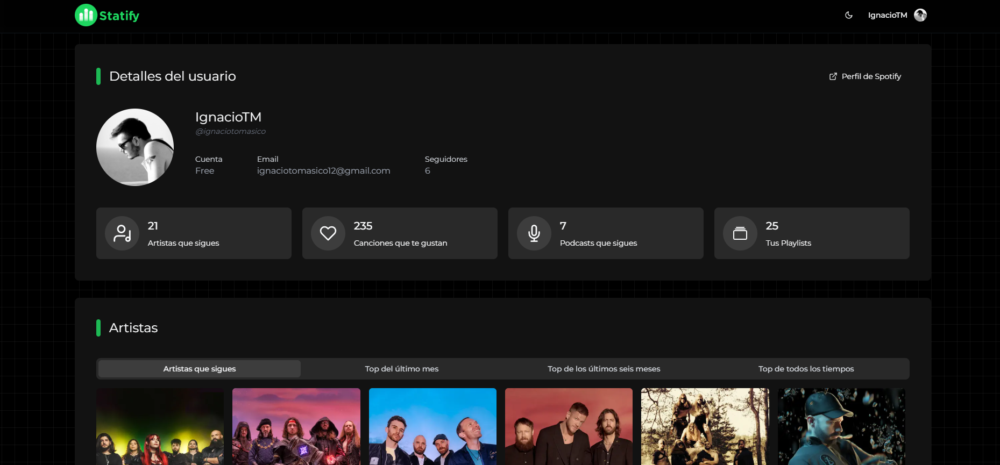

# <p align="center"></p>

<p align="center">
  <strong>Your personal Spotify dashboard for deep listening insights.</strong>
</p>

<p align="center">
  
  
  
  
</p>

---

## 🎵 Overview

**Statify** is a sleek, modern, and high-performance web application built with **Next.js 15** that connects to your Spotify account to provide detailed statistics about your music taste. Browse your top artists, tracks, playlists, and podcasts with a premium user interface designed for music lovers.

## ✨ Key Features

-   📊 **Interactive Dashboard**: A beautiful overview of your Spotify profile and activity.
-   🔝 **Top Stats**: Discover your favorite artists and tracks across different time ranges (4 weeks, 6 months, All Time).
-   📂 **Playlist Browser**: Access all your personal playlists in one place.
-   🎙️ **Shows & Podcasts**: Keep track of the series you're currently following.
-   🔍 **Advanced Search**: Instantly find any artist or track within the Spotify ecosystem.
-   👯 **Related Discovery**: Find new music through related artist recommendations.
-   🌓 **Dark & Light Mode**: A meticulously crafted UI that adapts to your preference with smooth transitions.
-   🌐 **Multilingual Support**: Available in both **English** and **Spanish** out of the box.
-   🔒 **Secure Auth**: Powered by **NextAuth.js** for a seamless and secure Spotify login experience.

## 🛠️ Tech Stack

-   **Framework**: [Next.js 15](https://nextjs.org/) (App Router & Turbopack)
-   **Styling**: [Tailwind CSS](https://tailwindcss.com/) with [Radix UI](https://www.radix-ui.com/) components.
-   **Data Fetching**: [TanStack Query](https://tanstack.com/query/latest) (React Query) for efficient caching and synchronization.
-   **Authentication**: [NextAuth.js](https://next-auth.js.org/) with Spotify Provider.
-   **I18n**: [Next-intl](https://next-intl-docs.vercel.app/) for internationalization.
-   **Icons**: [Lucide React](https://lucide.dev/) & [React Icons](https://react-icons.github.io/react-icons/).
-   **Notifications**: [Sonner](https://sonner.emilujohansson.se/) for elegant toast feedback.

## 🚀 Getting Started

### 1. Prerequisites
-   A **Spotify Developer Account**. Create an app in the [Spotify Dashboard](https://developer.spotify.com/dashboard) to get your credentials.
-   **Node.js** (v18 or higher) and a package manager (**pnpm** recommended).

### 2. Configure Environment Variables
Create a `.env.local` file in the root directory:

```env
# Spotify Credentials
SPOTIFY_CLIENT_ID=your_client_id
SPOTIFY_CLIENT_SECRET=your_client_secret

# NextAuth Configuration
NEXTAUTH_SECRET=your_random_secret_string
NEXTAUTH_URL=http://localhost:3000
```

### 3. Installation & Run
```bash
# Clone the repository
git clone https://github.com/ignaciotomasico12/statify.git

# Install dependencies
pnpm install

# Start development server
pnpm dev
```

Open [http://localhost:3000](http://localhost:3000) to see your stats!

## 📸 Preview

<p align="center">
  
</p>

---

<p align="center">
  Made with ❤️ by <a href="https://github.com/ignaciotomasico12">Ignacio</a>
</p>
